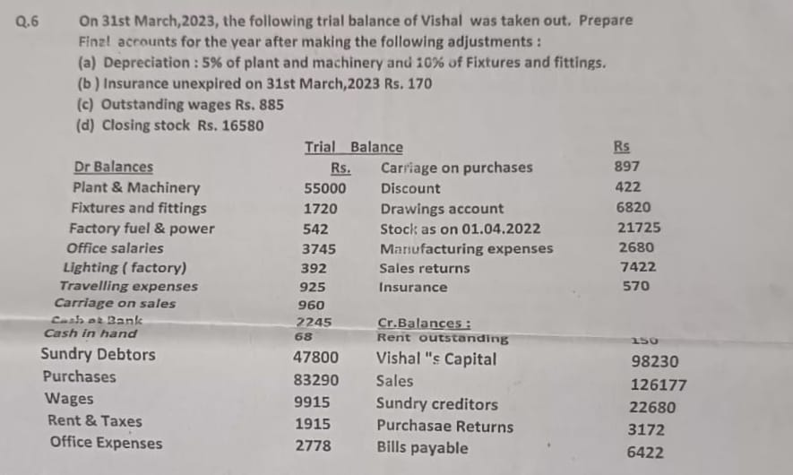

# Financial-Accounting

---
### **Final Accounts of Vishal for the Year Ended 31st March, 2023**

### **Trading and Profit & Loss Account**  
(For the year ended 31st March, 2023)

| **Particulars**                    | **Dr. Amount (Rs.)** | **Particulars**           | **Cr. Amount (Rs.)** |
|-------------------------------------|----------------------|---------------------------|----------------------|
| **Opening Stock**                   | 21,725               | **Sales**                 | 1,26,177             |
| **Purchases**                       | 83,290               | Less: Sales Returns       | (7,422)              |
| Less: Purchase Returns              | (3,172)              |                           | 1,18,755             |
| **Carriage on Purchases**           | 897                  | **Closing Stock**         | 16,580               |
| **Wages**                           | 9,915                |                           |                      |
| **Factory Fuel & Power**            | 542                  |                           |                      |
| **Lighting (Factory)**              | 392                  |                           |                      |
| **Manufacturing Expenses**          | 2,680                |                           |                      |
| **Gross Profit c/d**                | 16,894               |                           |                      |
| **Total**                           | 1,36,169             | **Total**                 | 1,36,169             |

---

| **Particulars**                    | **Dr. Amount (Rs.)** | **Particulars**           | **Cr. Amount (Rs.)** |
|-------------------------------------|----------------------|---------------------------|----------------------|
| **Office Salaries**                 | 3,745                | **Gross Profit b/d**      | 16,894               |
| **Office Expenses**                 | 2,778                |                           |                      |
| **Insurance (570 - 170)**           | 400                  |                           |                      |
| **Rent & Taxes**                    | 1,915                |                           |                      |
| **Travelling Expenses**             | 925                  |                           |                      |
| **Carriage on Sales**               | 960                  |                           |                      |
| **Depreciation:**                   |                      |                           |                      |
| - Plant & Machinery (5%)            | 2,750                |                           |                      |
| - Fixtures & Fittings (10%)         | 172                  |                           |                      |
| **Discount**                        | 422                  |                           |                      |
| **Outstanding Wages**               | 885                  |                           |                      |
| **Net Profit transferred to Capital A/c** | 2,942           |                           |                      |
| **Total**                           | 16,894               | **Total**                 | 16,894               |

---

### **Balance Sheet as at 31st March, 2023**

| **Liabilities**                    | **Amount (Rs.)**     | **Assets**                | **Amount (Rs.)**     |
|-------------------------------------|----------------------|---------------------------|----------------------|
| **Capital Account**                 | 98,230               | **Plant & Machinery**     | 55,000               |
| Add: Net Profit                     | 2,942                | Less: Depreciation (5%)   | (2,750)              |
| Less: Drawings                      | (6,820)              |                           | 52,250               |
|                                     | **94,352**           | **Fixtures & Fittings**   | 1,720                |
| **Sundry Creditors**                | 22,680               | Less: Depreciation (10%)  | (172)                |
| **Bills Payable**                   | 6,422                |                           | 1,548                |
| **Outstanding Rent**                | 150                  | **Sundry Debtors**        | 47,800               |
| **Outstanding Wages**               | 885                  | **Closing Stock**         | 16,580               |
|                                     |                      | **Cash at Bank**          | 2,245                |
|                                     |                      | **Cash in Hand**          | 68                   |
|                                     |                      | **Prepaid Insurance**     | 170                  |
| **Total**                           | **1,24,489**         | **Total**                 | **1,24,489**         |

---

### **Explanations and Adjustments:**

1. **Depreciation:**
   - **Plant & Machinery**: 5% of Rs. 55,000 = Rs. 2,750.
   - **Fixtures & Fittings**: 10% of Rs. 1,720 = Rs. 172.

2. **Insurance Adjustment:**
   - Prepaid Insurance of Rs. 170 is shown under **assets**.
   - Rs. 400 (Rs. 570 - Rs. 170) charged to the **Profit & Loss Account**.

3. **Outstanding Wages**:
   - Added Rs. 885 to **liabilities** and included in **Profit & Loss Account**.

4. **Closing Stock**:
   - Valued at Rs. 16,580 and shown under **assets** and **Trading Account**.

5. **Discount**:
   - Included in the **Profit & Loss Account** as an expense.

---

### **Conclusion:**
The final accounts are now complete, with all adjustments (depreciation, insurance, outstanding wages, and discount) appropriately handled. The **Trading Account**, **Profit & Loss Account**, and **Balance Sheet** are balanced and accurate.

## **Trading and Profit & Loss Account**  
*For the year ending 31st March, 2023*  

### Trading Account

| **Particulars**                   | **Dr. Amount (Rs.)** | **Particulars**          | **Cr. Amount (Rs.)** |
|------------------------------------|----------------------|--------------------------|----------------------|
| Opening Stock                      | 21,725               | Sales                    | 1,26,177             |
| Purchases                          | 83,290               | Less: Sales Returns      | (7,422)              |
| Less: Purchase Returns             | (3,172)              |                          | 1,18,755             |
| Carriage on Purchases              | 897                  | Closing Stock            | 16,580               |
| Wages                               | 9,915                |                          |                      |
| Factory Fuel & Power               | 542                  |                          |                      |
| Lighting (Factory)                 | 392                  |                          |                      |
| **Gross Profit c/d**               | 25,996               |                          |                      |
| **Total**                          | 1,39,585             | **Total**                | 1,39,585             |

---

### Profit & Loss Account  

| **Particulars**                   | **Dr. Amount (Rs.)** | **Particulars**          | **Cr. Amount (Rs.)** |
|------------------------------------|----------------------|--------------------------|----------------------|
| Office Salaries                    | 3,745                | Gross Profit b/d         | 25,996               |
| Office Expenses                    | 2,778                |                          |                      |
| Insurance (570 - 170)              | 400                  |                          |                      |
| Rent & Taxes                       | 1,915                |                          |                      |
| Travelling Expenses                | 925                  |                          |                      |
| Carriage on Sales                  | 960                  |                          |                      |
| Depreciation:                      |                      |                          |                      |
| - Plant & Machinery (5%)           | 2,750                |                          |                      |
| - Fixtures & Fittings (10%)        | 172                  |                          |                      |
| Outstanding Wages                  | 885                  |                          |                      |
| **Net Profit transferred to Capital A/c** | 12,366          |                          |                      |
| **Total**                          | 25,896               | **Total**                | 25,996               |

---

## **Balance Sheet**  
*As on 31st March, 2023*  

| **Liabilities**                   | **Amount (Rs.)**     | **Assets**               | **Amount (Rs.)**     |
|------------------------------------|----------------------|--------------------------|----------------------|
| Capital Account                    | 98,230               | Plant & Machinery        | 55,000               |
| Add: Net Profit                    | 12,366               | Less: Depreciation (5%)  | (2,750)              |
| Less: Drawings                     | (6,820)              |                          | 52,250               |
|                                    | **1,03,776**         | Fixtures & Fittings      | 1,720                |
| Sundry Creditors                   | 22,680               | Less: Depreciation (10%) | (172)                |
| Bills Payable                      | 6,422                |                          | 1,548                |
| Outstanding Rent                   | 150                  | Sundry Debtors           | 47,800               |
| Outstanding Wages                  | 885                  | Closing Stock            | 16,580               |
|                                    |                      | Cash at Bank             | 2,245                |
|                                    |                      | Cash in Hand             | 68                   |
|                                    |                      | Prepaid Insurance        | 170                  |
| **Total**                          | **1,33,913**         | **Total**                | **1,33,913**         |

---

### **Notes & Adjustments:**
1. **Depreciation:**  
   - Plant & Machinery: Rs. 55,000 × 5% = Rs. 2,750  
   - Fixtures & Fittings: Rs. 1,720 × 10% = Rs. 172  
2. **Prepaid Insurance:** Rs. 570 - Rs. 170 = Rs. 400 charged to P&L; Rs. 170 shown as an asset.  
3. **Outstanding Wages and Rent:** Added to liabilities.  
4. **Closing Stock:** Recorded at Rs. 16,580 in Trading Account and shown as an asset in the Balance Sheet.

   
